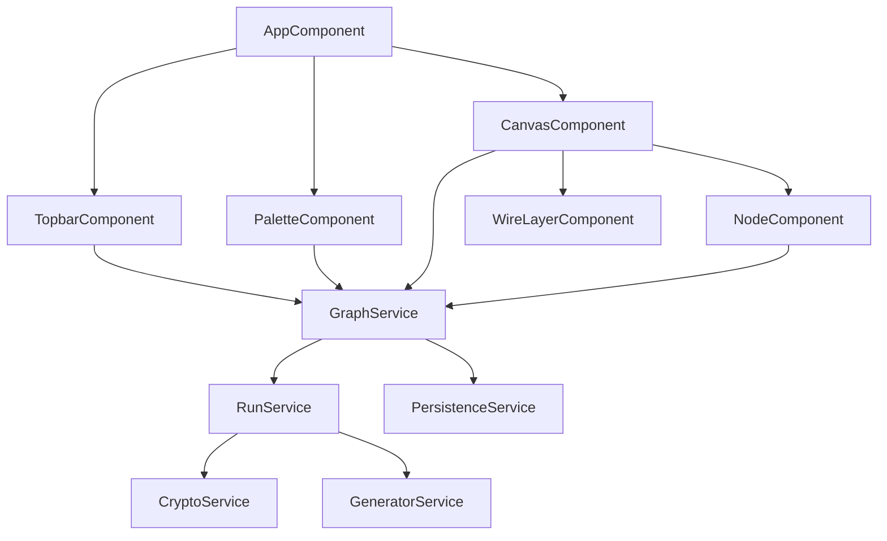

# 將 ApiFlow 前端遷移到 Angular 14.2.5

> 概述：將 ApiFlow 前端（純 HTML/CSS/JS，約 1140 行）改寫為 Angular 14.2.5 應用，建置輸出到 `ApiFlow/wwwroot`，沿用現有 .NET 靜態檔案服務與 `/proxy` 轉發端點，並將邏輯正規拆分為 Angular 元件與服務。

## 目標與不變項
- 後端 [ApiFlow/Program.cs](../ApiFlow/Program.cs) 維持不動：`UseDefaultFiles` + `UseStaticFiles` 服務 `wwwroot`，`POST /proxy` 轉發照舊。
- Angular `ng build` 輸出到 `ApiFlow/wwwroot`，產生 `index.html` 即可被現有設定服務。
- 前端對後端仍用相對路徑 `fetch('/proxy', ...)`，同源，無需改 CORS。

## 版本相容性（Angular 14.2.5 限制）
- Node.js `^14.15.0 || ^16.10.0`、TypeScript `~4.7`、RxJS `^6.5.3 || ^7.x`、zone.js `~0.11.4`。
- 用 `@angular/cli@14.2.5` 建立專案以鎖定相符版本。

## 專案結構
- 新增 Angular workspace 於 `ApiFlow/ClientApp/`。
- `angular.json` 設定 `architect.build.options.outputPath = "../wwwroot"`、`baseHref: "/"`。
- 移除舊靜態檔 `wwwroot/app.js`、`wwwroot/index.html`、`wwwroot/styles.css`（被建置產物取代）。`styles.css` 內容搬到 Angular 的全域 `src/styles.css`（變數、topbar、canvas、node、pin、wire 樣式幾乎可原樣沿用；元件專屬樣式可移到各元件）。

## 元件 / 服務架構

### Models（`src/app/models/graph.models.ts`）
- 將現有狀態轉成 interface：`GraphNode`（`kind: 'request' | 'transform'`）、`Wire`、`Pin`、`Header`、`Field`、`NodeResult`、常數 `METHODS`/`CONTENT_TYPES`/`PRESETS`/`TRANSFORM_PRESETS`/`ALGORITHMS`（直接對應 [app.js](../ApiFlow/wwwroot/app.js) L19-131）。

### Services
- `GraphService`：持有 `nodes`/`wires` 狀態、`addNode`/`addTransform`/`deleteNode`/`removePin`/`addWire`/`removeWire`、`uid()`、`spawnXY()`；以 `BehaviorSubject` 或可變陣列 + 預設變更偵測暴露給元件。整合自動存檔（debounce `scheduleSave`）。
- `PersistenceService`：`save`/`load`（localStorage key `apiflow.graph.v1`）、`exportWorkflow`/`importWorkflow`/`validateWorkflowData`、`migrateFields`（移植 [app.js](../ApiFlow/wwwroot/app.js) L962-1088）。
- `RunService`：`runAll`/`runNode`/`runTransform`/`topoSort`/`getPath`/`substitute`/`coerce`/`incomingValue`（移植 L757-939），HTTP 改用 `HttpClient` 呼叫 `/proxy`。
- `CryptoService`：`md5`、`applyAlgo`、`utf8Bytes`/`bytesToB64`/`hexToBytes`/`pemToDer` 等（移植 L110-258，幾乎逐行搬，型別補上）。
- `GeneratorService`：`GENERATORS`、`uuidv4`（移植 L68-84）。

### Components
- `AppComponent`：版面外殼（topbar + body：palette + canvas）。
- `TopbarComponent`：Base URL（`[(ngModel)]`）、Run all、Export、Import（`<input type=file>`）、Clear。
- `PaletteComponent`：新增 blank/transform 節點、generator 按鈕（點擊發事件給目前聚焦欄位插入 token）。
- `CanvasComponent`：捲動容器 + `<svg>` wire layer；負責節點拖曳與連線拖曳的 pointer 事件（移植 L695-755 的 `startNodeDrag`/`startWireDrag`）。
- `NodeComponent`：以 `*ngIf` 切換 request / transform 版型；用 `[(ngModel)]` 取代所有 `el()` + `oninput` 手動綁定（大幅簡化 L359-614）；headers/fields/outputs 用 `*ngFor`。
- `WireLayerComponent`：`*ngFor` 畫 bezier 路徑（移植 `wirePath`/`drawWires` L661-693），點擊刪線。

## 關鍵技術挑戰
- 連線端點座標：原碼用 `getBoundingClientRect` 讀 pin 的 DOM 位置畫線（L651-686）。Angular 做法：以 `ViewChildren` / template ref 取得 pin 元素，於 `ngAfterViewChecked` 或拖曳/版面變動後重算座標；或改為由節點 `x/y` + 已知 pin 偏移量計算（較穩定）。需在計畫中確立其一（建議仍讀 DOM 以維持忠實行為）。
- 拖曳：保留手動 pointer 事件以維持自訂貝茲連線行為；節點拖曳可選用 `@angular/cdk` DragDrop，但連線拖曳維持手寫。
- Generator 插入到游標位置：移植 `lastField`/`insertToken`（L946-960、L1124-1134），以 focus 追蹤 + 對 input 直接操作 selection。
- `FormsModule` 提供 `[(ngModel)]`；`HttpClientModule` 提供 `HttpClient`。

## 建置整合（可選但建議）
- 在 [ApiFlow/ApiFlow.csproj](../ApiFlow/ApiFlow.csproj) 加一個 MSBuild Target，於 build 前執行 `npm ci` + `npm run build`（輸出到 wwwroot），讓 `dotnet build` 一鍵產生前端；`.gitignore` 加入 `ClientApp/node_modules` 與建置產物。

## 驗證
- `cd ApiFlow/ClientApp && npm run build` 成功，`wwwroot/index.html` 產生。
- `dotnet run --project ApiFlow` 後開瀏覽器：新增節點、拖曳、連線、Run all（打 /proxy）、Transform（MD5/SHA/HMAC/RSA/Base64 結果與舊版一致）、Export/Import、重整後 localStorage 還原皆正常。

## 實作步驟（Todos）
1. **scaffold** — 用 `@angular/cli@14.2.5` 在 `ApiFlow/ClientApp` 建立 Angular workspace，設定 `angular.json` outputPath 為 `../wwwroot`、baseHref `/`，移除舊的 `app.js`/`index.html`/`styles.css`。
2. **models** — 建立 `models/graph.models.ts`，把 `PRESETS`/`TRANSFORM_PRESETS`/`ALGORITHMS`/`METHODS`/`CONTENT_TYPES` 及 node/wire/pin 型別移植過來。
3. **crypto-gen-services** — 移植 `CryptoService`（md5/applyAlgo/byte 與 PEM 輔助）與 `GeneratorService`（generators/uuidv4）。
4. **graph-persistence** — 實作 `GraphService`（狀態與節點/連線操作、自動存檔）與 `PersistenceService`（save/load/export/import/migrateFields）。
5. **run-service** — 實作 `RunService`（topoSort/substitute/getPath/runNode/runTransform/runAll），HTTP 改用 `HttpClient` 呼叫 `/proxy`。
6. **shell-topbar-palette** — 建立 `AppComponent` 版面、`TopbarComponent`（Base URL/Run/Export/Import/Clear）與 `PaletteComponent`（新增節點/transform/generator）。
7. **canvas-node-wire** — 建立 `CanvasComponent`（節點與連線拖曳）、`NodeComponent`（request/transform 版型、ngModel 綁定、headers/fields/outputs）、`WireLayerComponent`（SVG 貝茲線與刪線）。
8. **styles** — 把 `styles.css` 移到 Angular 全域樣式與各元件樣式，確認視覺與原版一致。
9. **build-integration**（可選）— 在 `ApiFlow.csproj` 加 MSBuild Target 於 build 前執行 npm 建置並更新 `.gitignore`。
10. **verify** — 驗證：`npm run build` 與 `dotnet run` 後，新增/拖曳/連線/Run all/Transform/Export/Import/重整還原皆正常。
